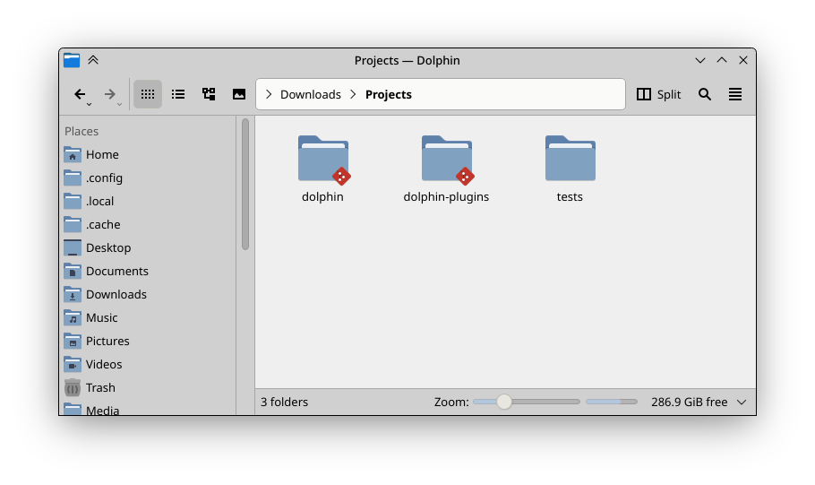

# dolphin-git-overlayicon-plugin

Git overlay icon for dolphin file manager.




# Compile and install

```
cmake -S . -B build -DCMAKE_BUILD_TYPE=Release
cmake --build build/
sudo cmake --install build/

# to remove
sudo rm /usr/lib/qt6/plugins/kf6/overlayicon/dolphin-git-overlayicon-plugin.so
```

> Git icon is from [papirus icon theme](https://github.com/PapirusDevelopmentTeam/papirus-icon-theme)
